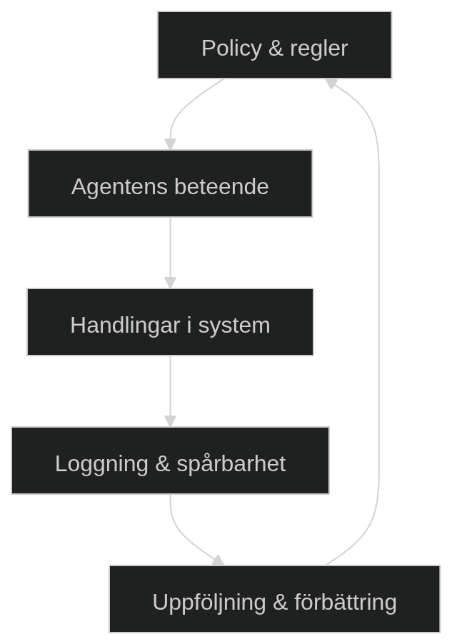

# Agenter i organisationer

När man bygger klassiska system (pipelines) digitaliserar man främst arbete, alltså steg som människor annars skulle utföra manuellt. Det kan vara att validera data, flytta information mellan system eller trigga en åtgärd baserat på en regel.

Med agenter sker något mer fundamentalt: vi börjar digitalisera **bedömning och beslutsfattande**.

Det innebär att systemet inte längre bara svarar på frågan *"vad ska göras?"*, utan också *"hur bör vi tänka?"*.

Det är en avgörande skillnad eftersom beslutsfattande i verkligheten nästan alltid sker under osäkerhet. Information är odullständig, formuleringar är otydliga och olika signaler kan peka åt olika håll. Det är i just de situationerna som agentiska system kan skapa stort värde - men också introducerar nya risker.

## Från determinism till tolkning
I traditionella system är beteendet förutsägbart eftersom det är hårdkodad:
```
Om X -> gör Y
```
Det fungerar när verkligehten är stabil och välstrukturerad. Problemet är att många organisatoriska processer inte ser ut så, utan de består av:
- mejl från kunder
- dokument med varierande kvalitet
- interna instruktioner som förämdras
- undantag och specialfall

Här blir regelbaserade system snabbt komplexa och svårhanterliga.

Agentiska system angriper det genom att arbeta med **tolkning** istället för **exakta regler**. De försöker förstå intention, sammanhang och relevant snarare än att matcha exakta villkor.

Det gör att de kan hantera komplexitet bättre, men till priset av att de inte längre är strikt deterministiska.

## Varians
Agentiska system introducerar varians. I ett klassiskt system är varians ett fel. I ett agentiskt system är det ofta en direkt följd av hur modellen fungerar - en feature. Den producerar inte ett exakt svar, utan ett sannolikt svar baserat på kontext.

Det kan kännas som en nackdel först, men det beror på hur systemet används.

I vissa fall är varians önsvärd, ett support-svar kan till exemepl formuleras på flera sätt utan att kvaliten försämras och ibland kan variation till och med förbättra användarupplevelsen. I andra fall, som policytolkning eller finansiella beslut, är varians istället direkt problematisk.

Det leder till en viktig designprincip:
> "Man ska inte försöka eliminera varians - utan kontrollera var den är tillåten"

Kontroll uppnås genom att begränsa handlingsutrymmet där det behövs, tillexempel genom att låta agenten välja mellan fördefinerade kategorier istället för att generera fria svar.

## Input som risk
En av de mest underskattade skillnaderna mellan klassisk automation och agentflöden är hur input behandlas.

I traditionella system är input oftast:
- strukturerad
- validerad
- förutsägbar

I agentiska system kommer input ofta från verkligheten, vilket innebär:
- otydliga formuleringar
- motstridig information
- potentiellt skadligt innehåll

Det förändrar hela säkerhetsmodellen.

Till exempel kan en användare, medvetet eller omedvetet, formulera input som påverkar agentens beteende på ett oönskat sätt. Dessutom kan agenten basera sina beslut på källor som är felaktiga eller irrelevanta.

Därför ska input behandlas som
> **Opålitlig tills motsatsen bevisats**

Det kröver att man designar systemet med skyddsmekanismer, tillexempel begränsningar i vad agenten får göra, samt kontrollpunkter där människor verifierar kritiska beslut.

## Varför vissa processer passar och andra inte
Agentiska system är inte en universallösning. De fungerar bäst i processer där problemet faktiskt är kopplat till tolkning och variation.

Ett bra sätt att förstå det är att jämföra två typer av arbete:

### 1. Regelstyrt arbete
Här är verkligheten tydlig:
- data har ett bestämt format
- regler är fasta
- avvikelser är fel

Exempel är betalningar eller bokföring. Här tillför en agent sällan värde och kan till och med introducera en risk.

### 2. Tolkningsbaserat arbete
Här är verkligheten mer komplex:
- input är ostrukturerad
- flera tolkningar är möjliga
- undantag är vanliga

Exempel är support, analys eller dokumenthantering. Här kan en agent drastiskt minska manuellt arbete eftersom den kan göra den initiala tolkningen.

Den viktigaste insikten är att agenten inte ersätter hela processen, utan oftast en specifik del där tolkning/resonemang krävs.

## Hybridflöden: där verkligt värde uppstår
I praktiken är de mest effektiva systemen nästan alltid hybrider.


Här används agenten där den är stark (tolkning, generering), medan klassiska system hanterar det som kräver precision (validering, exekvering).

Den uppdelningen är avgörande. om man använder egenten för mycket så ökar risken och kostnaden. Om man använder den för lite så missar man potentialen.

## Mätning av värde
Ett agentiskt system kan se imponerande ut utan att skapa faktisk nytta. Därför måste vi kunna mäta dess nytta på något sätt. Det spelar inte roll hur "smart" systemet ser ut att vara, utan:
- löser det ett verkligt problem snabbare?
- blir kvaliteten bättre?
- minskar det kostnader?

Ett viktigt mått är **kostnad per utfall**, snarare än kostnad per anrop, eftersom agentflöden ofta består av flera steg där kostnaden ackumuleras.

## Governance
I klassisk mjukvara vet vi exakt vad systemet gör, eftersom vi har skrivit reglerna. Därför handlar governance främst om:
- åtkomstkontroll
- logging
- regelefterlevnad

Men med agenter uppstår ett nytt problem
> Systemet fattar egna beslut inom givna ramar

Det innebär att vi inte längre bara behöver kontrollera *vad systemet kan göra* utan också:
- hur det resonerar
- varför det tog ett visst beslut
- om det borde ha stoppats

Governance blir ett sätt att hantera osäkerhet i beslutsfattande, inte bara teknisk åtkomst.

### 1. Vem får agenten vara?
Det handlar om agentens identitet och roll i en organisation. En agent är inte bara en funktion, den agerar som en roll, t.ex:
- supportmedarbetare
- analytiker
- assistent

Det avgör:
- vilken ton den använder
- vilka beslut den får ta
- vilken information den får se

Om rollen är otydlig blir beteendet otydligt.

### 2. Vad får agenten göra?
Här defineras:
- vilka system agenten får använda
- vilka actions den får utföra
- vilka datatyper den får hantera

Skillnaden mot klassiska system är att agenten kan *välja* att använda förmågorna. Det innebär att vi måste kontrollera både:
- kapabilitet (vad den kan göra)
- autonomi (vad får den göra utan godkännande)

### 3. Hur vet vi vad agenten har gjort?
Eftersom agenten fattar beslut måste vi kunna rekonstruera dem i efterhand. Det är inte bara en teknisk fråga, det är avgörande för:
- felsökning
- ansvar
- regelefterlevnad

Loggning i agentiska system behöver vara rikare än i klassiska system. Det räcker inte med `funktion x kördes`, man behöver också veta:
- vilken input som användes
- vilka källor agenten lutade sig mot
- vilka alternativ som övervägdes

### 4. Vad händer när det går fel?
Eftersom systemet inte är deterministiskt så kommer fel att uppstå. Det viktiga är inte att eliminera alla fel, utan att:
- upptäcka dem snabbt
- begränsa konsekvensen
- kunna återställa systemet

Det kräver:
- tydliga eskaleringsvägar
- definerade ansvar
- möjlighet till rollback

### 5. Hur förbättras systemet över tid?
Agentiska system är *inte* statiska, de behöver:
- uppföljning
- justering av instruktioner
- förbättring av processer

Governance måste därför inkludera:
- versionshantering
- experiment och utvärdering
- kontinuerlig förbättring

## Governance som sammanhängande system
Governance är inte en lista av separata komponenter, det är ett sammanhängande kontrollsystem.

<p style="text-align:center">
</img>
</p>

Governance är en loop:
1. Policy styr beteende
2. Beteende leder till handling
3. Handling loggas
4. Loggar analyseras
5. Systemet förbättras

Utan den loopen blir systemet snabbt okontrollerbart.

## Roller och ansvar
Ägarskap är viktigt eftersom fel annars lätt "försvinner" mellan funktioner.

### Djupare problem
Om en agent fattar ett dåligt beslut:
- är det utvecklarens fel?
- processägarens?
- modellens?

Utan tydliga roller finns ingen som kan:
- ta ansvar
- prioritera förbättringar
- fatta beslut om förändringar

### Praktisk konsekvens
Governance handlar lika mycket om organisation som teknik.

## Least privilege
Principen om least privileg innebär att agenten bara får den åtkomst som krävs, men i agentiska system får det en extra dimension. Eftersom agenten kan resonera och kombinera information kan för mycket åtkomst leda till:
- oväntade beslut
- dataläckage
- felaktiga åtgärder

Därför blir behörighet inte bara en säkerhetsfråga utan en del av beteendekontroll.

## Human-in-the-loop
Human in the loop är inte bara en fallback, en säkerhetsventil utan bör vara en del av själva processdesignen. HITL är ett sätt att:
- styra kvalitet
- minska risk
- bygga förtroende

HITL borde finnas där osäkerheten är hög och konsekvenserna av fel är stora. Då blir systemet både effektivt och robust.

## Testing
Eftersom agentiska system har varians så räcker det inte med traditionell testning, man måste testa:
- typiska scenarier (happy paths)
- ovanliga men ändå möjliga fall (edge cases)
- policyefterlevnad

Det gör testningen mer lik:
> Simulering av verkligheten mer än verifiering av kod

## Riskhantering som en del av designen
Säkerheten ska inte bara läggas på när systemet är klart, som en efterkonstruktion. Riskerna ska hanteras under tiden man bygger flödet för att bli direkt integrerat, genom:
- design av flödet
- begränsning av agenternas handlingsutrymme
- kontrollpunkter